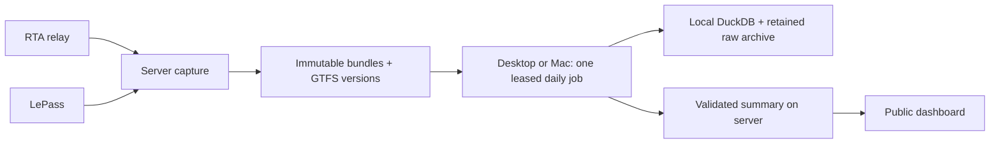

# Server capture, daily workstation processing

**Current deployment:** the desktop now downloads capture from **MotherDuck**,
not directly from this server API. See `OPERATIONS.md`,
`scripts/upload-server-capture.ts`, and `scripts/process-motherduck-capture.ts`.
The leased two-workstation/direct-server workflow below is retained as an
alternative, but its desktop timer is disabled. Do not reenable it against the
active server spool: verified older payloads are now retained in MotherDuck.

The server continuously captures both RTA/SSE and LePass. Either workstation
can process the daily job and publish the dashboard. Each workstation keeps its
own historical database and raw archive; no live DuckDB file is shared.



This alternative mode is inactive. A second workstation has not been provisioned.

## Daily workflow

1. The server fsyncs each incoming frame, then packages bounded immutable gzip
   bundles. Packaging verifies the committed bundle before deleting its loose
   journal files. Provider clocks, receipt clocks, original bytes and batch IDs
   survive unchanged. SHA256 manifests identify the cumulative capture stream.
2. Both workstations attempt `npm run process:daily` every 15 minutes. The server
   makes a job due at **06:00 America/Chicago**, including DST. The first available
   workstation claims it. A single cumulative catchup job covers missed days;
   repeated polling after success performs no analysis until another day is due.
3. A claim first packages the finite set of loose frames already present, then
   freezes the input manifest. New arrivals remain available for the next job.
   The job's date identifies the daily schedule; its input cutoff can include
   observations from the current partial day as well as closed dates.
4. The workstation verifies new downloads, retains the raw bundles, imports only
   new/retry-incomplete bundles, and runs the existing finite study/OTP backfill.
   Imported batch IDs make an interrupted commit safe to replay. Already imported
   raw bundles are not fully reread each day. Historical Parquet remains subject
   to its existing checksum verification when restored or used for analysis.
5. A renewable server lease prevents simultaneous owners. If a workstation
   disconnects, the other can claim the same immutable job after the lease
   expires (15 minutes by default). An expired owner cannot publish. A separate
   native process lock prevents duplicate jobs on the same workstation and is
   released by the OS after a crash. Worker shutdown waits for its analysis child
   to exit before releasing that lock.
6. Only a successful job-specific backfill completion marker permits upload.
   The server validates the bounded public summary, the lease/fence, and the
   cumulative input manifest before atomically publishing. It retains the last
   good snapshot through a failed run. The dashboard shows live collection and
   completed analysis times separately.

The server preserves each GTFS version with its actual first-observed timestamp.
Workers use that evidence for historical schedule selection; tomorrow's download
is never assumed to have applied yesterday. Processing workers need **no LePass
or MotherDuck credentials**. LePass session refresh has one owner: the server.

## Initialize both workstations from the same history

Pause the current database worker, finish ingesting its journal, and stop local
collection before creating the baseline. Seed creation obtains the native
database writer lock, checkpoints it, and copies the database and verified cold
archives while retaining that lock. It excludes session credentials, tokens and
live journal files. Keep the resulting package private.

```bash
npm run process:daily -- --data-dir /existing/transit-data --seed-create /private/transit-seed
```

This prints a `baseline_id` and initializes that existing directory as the first
worker. Transfer the entire seed package through your authenticated file-transfer
channel to the Mac; do not put it in GitHub. Restore into a **new** directory:

```bash
npm run process:daily -- --data-dir /new/transit-worker-data --seed-restore /private/transit-seed
```

Restore verifies every file before registering the same baseline. It relocates
the cold archive catalog and manifests to the destination path. A Mac with an
empty or unrelated database cannot claim the historical job. Both machines must
use the same code and bundled evidence as the server; a content digest checks
this even in a Docker image without `.git`. Update all three checkouts/images
together when the processing code changes.

Keep the original seed and workstation archives. This first version **retains all
server bundles** and does not automatically prune them after a download. It does
not promise unlimited retention: monitor server disk use and arrange verified
archive retention before removing any copies. Existing 80% filesystem and 10 GB
free-space guards still apply; neither deployment nor collection bypasses them.
The full historical database stays on the workstations, saving that space on the
capture server.

## Capture server configuration

Use the root Dockerfile and a persistent `/app/data` mount, one container at a
time. Keep the existing source configuration and encrypted LePass session, with
its key supplied separately. Stop the previous session owner before transferring
that session. Required additions:

```dotenv
TRANSIT_DATA_DIR=/app/data
LOCAL_ANALYSIS_ENABLED=false
PROCESSING_SERVER_ENABLED=true
PROCESSING_BASELINE_ID=<baseline_id printed above>
TRANSIT_PROCESSING_TOKEN=<new random secret of at least 32 characters>
PROCESSING_DUE_HOUR=6
PROCESSING_LEASE_SECONDS=900
MOTHERDUCK_BOOTSTRAP=false
MOTHERDUCK_CLOUD_WRITES=false
```

Use a separate `TRANSIT_SUMMARY_TOKEN` for the dashboard's existing read-only
summary connection. The processing token authorizes raw downloads and result
publication and belongs only on the server and trusted workstations. Use HTTPS
or an SSH tunnel to a loopback URL. Redirects are rejected.

Private processing endpoints under `/internal/processing` are `GET status`,
`GET manifest`, `GET bundles/:id`, `GET schedules/:id`, and `POST claim`, `renew`,
`release`, `complete`. The status and manifests contain no session tokens. The
same capture directory must have exactly one server process; workstation workers
coordinate over this API, never by opening the server's files directly.

The public dashboard keeps its existing saved-summary connection and uses:

```dotenv
TRANSIT_SUMMARY_STALE_MS=129600000
```

That is a 36-hour analysis freshness window for daily mode. Fresh source clocks
do not make an old analysis fresh. When both workstations are offline, capture
continues within the server's disk budget and the dashboard retains its last
completed analysis with the appropriate age warning.

## Workstation configuration and scheduling

Install Node.js 20.3+ and dependencies with `npm ci`. Use a private environment
file outside the checkout (for example `~/.config/transit-processing.env`, mode
600). Give each workstation a distinct `PROCESSING_WORKER_ID`:

```dotenv
TRANSIT_DATA_DIR=/absolute/path/to/worker-data
PROCESSING_SERVER_URL=https://your-collector.example
TRANSIT_PROCESSING_TOKEN=<same processing secret>
PROCESSING_WORKER_ID=desktop
LOCAL_DB_MEMORY=4GB
LOCAL_DB_THREADS=4
NODE_OPTIONS=--max-old-space-size=3072
MOTHERDUCK_BOOTSTRAP=false
MOTHERDUCK_CLOUD_WRITES=false
```

Run one attempt using that file:

```bash
DOTENV_CONFIG_PATH=/absolute/path/to/transit-processing.env npm run process:daily
```

`deploy/processing` contains scheduler templates. They poll for work; the server
decides whether a new daily job is due, so both schedules can run together.

- Linux/WSL: replace paths in `transit-daily.service`, install the service and
  timer in `~/.config/systemd/user/`, then run `systemctl --user daemon-reload`
  and `systemctl --user enable --now transit-daily.timer`. The persistent timer
  catches up when the user service manager is available.
- macOS: replace the absolute Node, checkout, environment-file and log paths in
  `dev.cargobay.transit-daily.plist`, copy it to `~/Library/LaunchAgents/`, and
  load it with `launchctl bootstrap gui/$(id -u) <absolute-plist-path>`. This
  runs in the logged-in user's session and tries again every 15 minutes.
- Windows host: `register-windows-task.ps1` creates a Task Scheduler job that
  starts the WSL worker directly. Supply `-Distribution`, `-RepositoryPath`,
  `-EnvironmentFile`, and `-NodePath` as absolute WSL paths. Use this instead of
  the WSL timer when you want Windows to launch the distribution. It uses
  `StartWhenAvailable` and prevents overlapping task instances. PowerShell
  registration and native macOS scheduling require testing on those hosts;
  this repository's automated tests run on Linux. Native Windows Node execution
  is not yet validated for the POSIX directory-fsync durability paths.

No scheduler forces a sleeping workstation to stay awake. The other machine can
take the job, or an available machine catches up later. Scheduler and job logs
contain status and timings; keep them bounded using the host's log retention.

## CPU, memory and GPU

The current analysis uses DuckDB and TypeScript CPU work; it contains no GPU
kernels. `LOCAL_DB_THREADS` now controls native DuckDB parallelism (default 2),
while `LOCAL_DB_MEMORY` and the JavaScript heap are separate limits. Route
reconstruction is still sequential TypeScript. Adding threads does not parallelize
those loops, and no speedup is promised until measured.

The inspected WSL instance exposes 24 CPU threads but about 16 GB of memory. Keep
the database on its Linux filesystem, not a mounted Windows directory. Increase
the worker settings according to the memory actually available to that runtime,
leaving room for the JavaScript process and other applications. DuckDB's
[performance guidance](https://duckdb.org/docs/current/guides/performance/environment)
describes memory and parallelism tradeoffs. WSL's memory allowance can be changed
in [`.wslconfig`](https://learn.microsoft.com/en-us/windows/wsl/wsl-config); applying
that change requires restarting WSL, so do it after moving collection to the
server. No WSL restart or host setting change is performed by this pipeline.

Analysis cycles log elapsed milliseconds. The workstation also saves
`processing/last-completed.json` with total job time and its accepted manifest.
Finite backfills run queued batches immediately instead of waiting between
polling cycles; continuous collection retains its normal polling interval.
Measure a representative daily run on each host before considering GPU-specific
algorithms or another execution environment.
